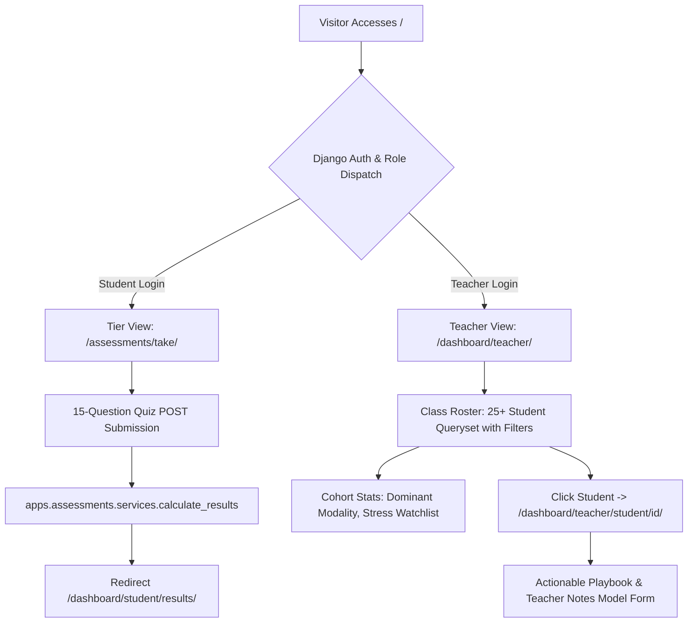

# 🛠️ Django Step-by-Step Build & Implementation Specification
> **Student-Teacher Mindset & Personality Assessment Platform**  
> *A granular, phase-by-phase blueprint designed for coding, testing, and verifying with Django.*

---

## 📑 Table of Contents
1. [Django Architecture & Flow](#-django-architecture--flow)
2. [Phase 1: Django Setup, Custom User Model & Role-Based Auth](#-phase-1-django-setup-custom-user-model--role-based-auth)
3. [Phase 2: Assessments App & Dynamic Quiz Engine](#-phase-2-assessments-app--dynamic-quiz-engine)
4. [Phase 3: Python Scoring Engine & Insights Generator](#-phase-3-python-scoring-engine--insights-generator)
5. [Phase 4: Student Results Portal & Strategy View](#-phase-4-student-results-portal--strategy-view)
6. [Phase 5: Teacher Dashboard & 25-Student Classroom Roster](#-phase-5-teacher-dashboard--25-student-classroom-roster)
7. [Phase 6: Teacher's 1-on-1 Student Playbook & Notes](#-phase-6-teachers-1-on-1-student-playbook--notes)
8. [Phase 7: Demo Data Seeder Command, PDF Export & Final Polish](#-phase-7-demo-data-seeder-command-pdf-export--final-polish)

---

## 📐 Django Architecture & Flow



---

## 🔹 Phase 1: Django Setup, Custom User Model & Role-Based Auth

### 🎯 Phase Objective
Set up the Django environment, configure a custom `AbstractUser` with role fields, build registration/login views, and set up role-based redirect dispatching.

### 📁 Files to Create/Configure
- `mindset_platform/settings.py`
- `apps/accounts/models.py`
- `apps/accounts/forms.py`
- `apps/accounts/views.py`
- `apps/accounts/urls.py`
- `templates/base.html`
- `templates/accounts/login.html`
- `templates/accounts/signup.html`

### 💻 Code Details & Components

#### 1. Custom User Model (`apps/accounts/models.py`)
```python
from django.contrib.auth.models import AbstractUser
from django.db import models

class User(AbstractUser):
    class Role(models.TextChoices):
        STUDENT = 'STUDENT', 'Student'
        TEACHER = 'TEACHER', 'Teacher'

    class AcademicTier(models.TextChoices):
        SCHOOL = 'SCHOOL', 'Schooling (10th / 12th)'
        UG = 'UG', 'Undergraduate'
        PG = 'PG', 'Postgraduate'

    role = models.CharField(max_length=10, choices=Role.choices, default=Role.STUDENT)
    academic_tier = models.CharField(max_length=10, choices=AcademicTier.choices, null=True, blank=True)
    institution = models.CharField(max_length=150, blank=True)
    avatar_color = models.CharField(max_length=20, default='indigo')

    def is_teacher_user(self):
        return self.role == self.Role.TEACHER

    def is_student_user(self):
        return self.role == self.Role.STUDENT
```

#### 2. Settings Configuration (`mindset_platform/settings.py`)
```python
AUTH_USER_MODEL = 'accounts.User'
LOGIN_URL = 'accounts:login'
LOGIN_REDIRECT_URL = 'accounts:dispatch'
LOGOUT_REDIRECT_URL = 'accounts:login'
```

#### 3. Role Dispatch View (`apps/accounts/views.py`)
```python
from django.shortcuts import redirect
from django.views import View
from django.contrib.auth.mixins import LoginRequiredMixin

class RoleDispatchView(LoginRequiredMixin, View):
    def get(self, request):
        if request.user.is_teacher_user():
            return redirect('dashboard:teacher_overview')
        return redirect('assessments:take_quiz')
```

### 🧪 How to Test & Verify Phase 1
```bash
python manage.py makemigrations accounts
python manage.py migrate
python manage.py createsuperuser
python manage.py runserver
```
- [ ] Sign up as a **Student** with tier `Undergraduate` $\rightarrow$ Redirects to `/assessments/take/`.
- [ ] Sign up as a **Teacher** $\rightarrow$ Redirects to `/dashboard/teacher/`.
- [ ] Direct URL `/dashboard/teacher/` returns 403 or redirects if accessed by a student.

---

## 🔹 Phase 2: Assessments App & Dynamic Quiz Engine

### 🎯 Phase Objective
Build the assessment models, questions database per qualification tier (School, UG, PG), and the interactive questionnaire view.

### 📁 Files to Create/Configure
- `apps/assessments/models.py`
- `apps/assessments/views.py`
- `apps/assessments/urls.py`
- `apps/assessments/admin.py`
- `templates/assessments/take_quiz.html`

### 💻 Code Details & Components

#### 1. Question & Choice Models (`apps/assessments/models.py`)
```python
from django.db import models
from django.conf import settings

class Question(models.Model):
    class Category(models.TextChoices):
        VARK = 'VARK', 'Learning Style'
        MINDSET = 'MINDSET', 'Growth Mindset'
        STRESS = 'STRESS', 'Stress & Anxiety'
        COMMUNICATION = 'COMM', 'Communication'

    tier = models.CharField(max_length=10, choices=settings.AUTH_USER_MODEL.AcademicTier.choices)
    category = models.CharField(max_length=10, choices=Category.choices)
    prompt = models.TextField()
    order = models.PositiveIntegerField(default=0)

    class Meta:
        ordering = ['order']

class Choice(models.Model):
    question = models.ForeignKey(Question, on_delete=models.CASCADE, related_name='choices')
    text = models.CharField(max_length=255)
    
    # Weight vectors (0 to 5)
    visual_weight = models.PositiveSmallIntegerField(default=0)
    auditory_weight = models.PositiveSmallIntegerField(default=0)
    kinesthetic_weight = models.PositiveSmallIntegerField(default=0)
    growth_weight = models.PositiveSmallIntegerField(default=0)
    stress_weight = models.PositiveSmallIntegerField(default=0)
```

#### 2. Quiz Runner View (`apps/assessments/views.py`)
```python
from django.shortcuts import render, redirect
from django.views.generic import View
from django.contrib.auth.mixins import LoginRequiredMixin
from .models import Question
from .services import calculate_and_save_submission

class TakeQuizView(LoginRequiredMixin, View):
    def get(self, request):
        tier = request.user.academic_tier or 'SCHOOL'
        questions = Question.objects.filter(tier=tier).prefetch_related('choices')
        return render(request, 'assessments/take_quiz.html', {
            'questions': questions,
            'tier': tier
        })

    def post(self, request):
        submission = calculate_and_save_submission(request.user, request.POST)
        return redirect('dashboard:student_results', submission_id=submission.id)
```

### 🧪 How to Test & Verify Phase 2
- [ ] Add 5 questions via Django Admin (`/admin/`).
- [ ] Log in as student and take the quiz at `/assessments/take/`.
- [ ] Verify questions match the student's academic tier.

---

## 🔹 Phase 3: Python Scoring Engine & Insights Generator

### 🎯 Phase Objective
Implement the pure Python scoring engine that aggregates weights into percentage scores, assigns a **Learning Persona**, and generates the **Student Study Tips** and **Teacher Playbook**.

### 📁 Files to Create/Configure
- `apps/assessments/services.py`
- `apps/assessments/tests.py`

### 💻 Code Details (`apps/assessments/services.py`)
```python
from .models import Submission, Choice

PERSONA_RULES = [
    {
        'title': 'The Visual Strategist',
        'tagline': 'Master of diagrams, structural mind-maps, and visual modeling.',
        'dominant': 'visual',
        'teacher_motivation': 'Provide charts, rubrics, and visual progress trackers.',
        'teacher_comm': 'Prefers written summaries and diagrammatic walkthroughs.',
        'teacher_caution': 'Can get overwhelmed by fast audio-only lectures.'
    },
    {
        'title': 'The Hands-On Innovator',
        'tagline': 'Learns best by doing, building, and trial-and-error experimentation.',
        'dominant': 'kinesthetic',
        'teacher_motivation': 'Assign practical projects and lab exercises over passive reading.',
        'teacher_comm': 'Responds well to interactive problem-solving discussions.',
        'teacher_caution': 'Loses focus during long static presentations.'
    },
    {
        'title': 'The Analytical Synthesizer',
        'tagline': 'Thrives on logic, deep reasoning, and structured problem breakdowns.',
        'dominant': 'growth',
        'teacher_motivation': 'Challenge with open-ended problem solving and research questions.',
        'teacher_comm': 'Appreciates direct, logical feedback and autonomous goals.',
        'teacher_caution': 'May hesitate to ask for help when stuck.'
    }
]

def calculate_and_save_submission(user, post_data):
    choice_ids = [int(v) for k, v in post_data.items() if k.startswith('q_') and v.isdigit()]
    selected_choices = Choice.objects.filter(id__in=choice_ids)
    
    # Sum weights
    v_total = sum(c.visual_weight for c in selected_choices)
    a_total = sum(c.auditory_weight for c in selected_choices)
    k_total = sum(c.kinesthetic_weight for c in selected_choices)
    g_total = sum(c.growth_weight for c in selected_choices)
    s_total = sum(c.stress_weight for c in selected_choices)
    
    # Normalize to 0-100%
    max_w = max(len(choice_ids) * 5, 1)
    visual_pct = int((v_total / max_w) * 100)
    auditory_pct = int((a_total / max_w) * 100)
    kinesthetic_pct = int((k_total / max_w) * 100)
    growth_pct = int((g_total / max_w) * 100)
    stress_pct = int((s_total / max_w) * 100)
    
    # Pick persona
    persona = PERSONA_RULES[0]
    if kinesthetic_pct > visual_pct and kinesthetic_pct > auditory_pct:
        persona = PERSONA_RULES[1]
    elif growth_pct >= 70:
        persona = PERSONA_RULES[2]

    submission = Submission.objects.create(
        student=user,
        tier=user.academic_tier or 'SCHOOL',
        visual_score=visual_pct,
        auditory_score=auditory_pct,
        kinesthetic_score=kinesthetic_pct,
        growth_score=growth_pct,
        stress_score=stress_pct,
        persona_title=persona['title'],
        persona_tagline=persona['tagline'],
        teacher_motivation=persona['teacher_motivation'],
        teacher_communication=persona['teacher_comm'],
        teacher_caution=persona['teacher_caution']
    )
    return submission
```

### 🧪 How to Test & Verify Phase 3
```bash
python manage.py test apps.assessments
```
- [ ] Unit tests pass, verifying scores correctly scale between 0 and 100%.

---

## 🔹 Phase 4: Student Results Portal & Strategy View

### 🎯 Phase Objective
Render a high-impact, celebratory results page for the student showing their persona badge, radar/progress score bars, and actionable study tips.

### 📁 Files to Create/Configure
- `apps/dashboard/views.py` (`StudentResultView`)
- `templates/dashboard/student_results.html`

### 🖥️ UI Components
1. **Persona Header Card:** Gradient card with icon, Title (*"The Visual Strategist"*), and superpower tagline.
2. **Learning Modality Breakdown:** Animated progress bars for Visual, Auditory, and Kinesthetic.
3. **Actionable Study Toolkit:** 3 customized study habits for their level (e.g. *Use Feynman technique, build mind-maps, study in 25-minute sprints*).
4. **Action Buttons:** `Print / Download PDF Summary`, `Back to Home`.

---

## 🔹 Phase 5: Teacher Dashboard & 25-Student Classroom Roster

### 🎯 Phase Objective
Provide teachers with a command center showing class metrics and a 25-student searchable roster.

### 📁 Files to Create/Configure
- `apps/dashboard/views.py` (`TeacherDashboardView`)
- `templates/dashboard/teacher_dashboard.html`

### 💻 Queryset & View Logic
```python
from django.views.generic import ListView
from django.contrib.auth.mixins import UserPassesTestMixin
from django.db.models import Q, Avg
from apps.assessments.models import Submission

class TeacherDashboardView(UserPassesTestMixin, ListView):
    template_name = 'dashboard/teacher_dashboard.html'
    context_object_name = 'submissions'

    def test_func(self):
        return self.request.user.is_authenticated and self.request.user.is_teacher_user()

    def get_queryset(self):
        qs = Submission.objects.select_related('student').order_by('-submitted_at')
        
        # Filtering
        tier = self.request.GET.get('tier')
        if tier:
            qs = qs.filter(tier=tier)
            
        search_query = self.request.GET.get('q')
        if search_query:
            qs = qs.filter(Q(student__first_name__icontains=search_query) | 
                           Q(student__last_name__icontains=search_query) |
                           Q(student__email__icontains=search_query))
        return qs

    def get_context_data(self, **kwargs):
        ctx = super().get_context_data(**kwargs)
        all_subs = Submission.objects.all()
        ctx['total_students'] = all_subs.count()
        ctx['avg_growth'] = all_subs.aggregate(Avg('growth_score'))['growth_score__avg'] or 0
        ctx['high_stress_count'] = all_subs.filter(stress_score__gte=70).count()
        return ctx
```

---

## 🔹 Phase 6: Teacher's 1-on-1 Student Playbook & Notes

### 🎯 Phase Objective
When a teacher clicks any student, render their deep-dive profile containing the **"How to Teach Me" 3-Pillar Playbook** and a private notes system.

### 📁 Files to Create/Configure
- `apps/dashboard/models.py` (`TeacherNote`)
- `apps/dashboard/forms.py` (`TeacherNoteForm`)
- `apps/dashboard/views.py` (`StudentPlaybookView`)
- `templates/dashboard/student_playbook.html`

### 💻 Teacher Notes Model & Form
```python
# apps/dashboard/models.py
class TeacherNote(models.Model):
    teacher = models.ForeignKey(settings.AUTH_USER_MODEL, on_delete=models.CASCADE, related_name='authored_notes')
    submission = models.ForeignKey('assessments.Submission', on_delete=models.CASCADE, related_name='teacher_notes')
    content = models.TextField()
    created_at = models.DateTimeField(auto_now_add=True)
```

### 🖥️ Playbook UI Layout
- **Top Card:** Student name, email, level badge, primary persona.
- **Pillar 1 (Motivation):** How to encourage and assign tasks.
- **Pillar 2 (Communication):** How to deliver constructive criticism without causing friction.
- **Pillar 3 (Stress Signals):** Early signs of anxiety & how to support them.
- **Private Observation Log:** Form to write observation notes + list of past notes with timestamps.

---

## 🔹 Phase 7: Demo Data Seeder Command, PDF Export & Final Polish

### 🎯 Phase Objective
Create a custom Django management command to seed 25 realistic students with complete test submissions, add PDF export, and polish the CSS.

### 📁 Files to Create/Configure
- `apps/core/management/commands/seed_demo_data.py`
- `apps/dashboard/views.py` (`export_pdf_report`)
- `static/css/style.css`

### 💻 Demo Data Seeder Command
```bash
python manage.py seed_demo_data
```
Creates:
- 1 Demo Teacher: `teacher@school.edu` (Password: `teacher123`)
- 1 Demo Student: `student@school.edu` (Password: `student123`)
- 25 Diverse Student submissions across 10th/12th Grade, Undergrad, and Postgrad with varied personas and score breakdowns.

---

## 🚀 Execution Summary Table

| Phase | Django App / Module | Primary Deliverables | Test Command / Verification |
| :---: | :--- | :--- | :--- |
| **Phase 1** | `apps.accounts` | Custom User, Roles (`STUDENT`/`TEACHER`), Login/Signup forms, Role dispatcher | `python manage.py runserver` & test login redirects |
| **Phase 2** | `apps.assessments` | `Question` & `Choice` models, tier-specific quiz template & form handling | Verify quiz rendering by tier |
| **Phase 3** | `apps.assessments.services` | Psychometric scoring, VARK percentages, and Persona generator | `python manage.py test apps.assessments` |
| **Phase 4** | `apps.dashboard` (Student) | `StudentResultView`, persona badge, score charts, study strategy guide | Complete quiz & view result card |
| **Phase 5** | `apps.dashboard` (Teacher) | `TeacherDashboardView`, 25-student roster, tier/style filters, search | Filter by "School" or search student |
| **Phase 6** | `apps.dashboard` (Playbook) | `StudentPlaybookView`, 3-pillar teaching playbook, `TeacherNote` form | Save note on student profile |
| **Phase 7** | `apps.core` & Reports | `seed_demo_data` management command, PDF export, responsive styling | `python manage.py seed_demo_data` |
