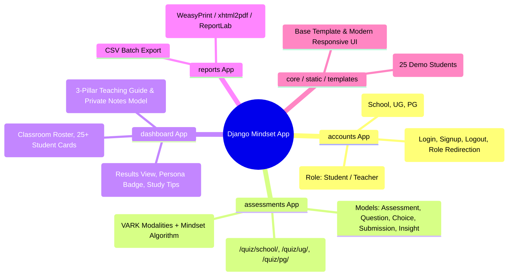

# 🎓 Student-Teacher Mindset & Personality Assessment Platform
> **Django Architecture, System Design & Stage-by-Stage Implementation Roadmap**

---

## 💡 1. Concept & Feasibility in Django

### Why Django is an Ideal Choice:
1. **Built-in Role & Auth System:** Django's `AbstractUser`, groups, and permission decorators (`@login_required`, `@user_passes_test`, or custom mixins) provide rock-solid security for separating Student and Teacher access right out of the box.
2. **Robust ORM:** Effortlessly handles relationships between Teachers, Classrooms, Students, Question Sets, and Test Submissions.
3. **Built-in Admin Panel:** Gives school administrators an instant back-office interface to manage question banks, review flagged students, and inspect cohorts without needing extra code.
4. **Fast Development (MVT Architecture):** Clean separation between Models (ORM), Views (Business & Scoring Logic), and Templates (HTML5 + Modern CSS + HTMX/Vanilla JS).

---

## 🧠 2. Django System Architecture & Mind Map



---

## 🏗️ 3. Django App Structure & Data Schema

### 📂 Recommended Project Layout
```text
mindset_platform/
├── manage.py
├── mindset_platform/          # Django project settings & root URLs
│   ├── settings.py
│   ├── urls.py
│   └── wsgi.py
├── apps/
│   ├── accounts/              # Custom User, Auth, Registration, Profiles
│   │   ├── models.py
│   │   ├── views.py
│   │   ├── forms.py
│   │   └── urls.py
│   ├── assessments/           # Question banks, Tier logic, Scoring engine
│   │   ├── models.py
│   │   ├── views.py
│   │   ├── services.py        # Scoring & psychometric logic
│   │   └── urls.py
│   ├── dashboard/             # Student results, Teacher roster & playbooks
│   │   ├── models.py          # TeacherNote model
│   │   ├── views.py
│   │   └── urls.py
│   └── core/                  # Landing page, context processors, templatetags
│       └── management/commands/seed_demo_data.py
├── templates/                 # Django HTML templates (base.html, accounts/, assessments/, dashboard/)
└── static/                    # CSS, JS, Images, Icons
```

---

## ⚙️ 4. Core Django Models (ORM)

```python
# apps/accounts/models.py
from django.contrib.auth.models import AbstractUser
from django.db import models

class User(AbstractUser):
    class Role(models.TextChoices):
        STUDENT = 'STUDENT', 'Student'
        TEACHER = 'TEACHER', 'Teacher'
        ADMIN = 'ADMIN', 'Admin'
        
    class AcademicTier(models.TextChoices):
        SCHOOL = 'SCHOOL', 'Schooling (10th / 12th)'
        UG = 'UG', 'Undergraduate'
        PG = 'PG', 'Postgraduate'

    role = models.CharField(max_length=10, choices=Role.choices, default=Role.STUDENT)
    academic_tier = models.CharField(max_length=10, choices=AcademicTier.choices, null=True, blank=True)
    institution_name = models.CharField(max_length=200, blank=True)
    avatar = models.ImageField(upload_to='avatars/', null=True, blank=True)

# apps/assessments/models.py
class Question(models.Model):
    class Category(models.TextChoices):
        VARK = 'VARK', 'VARK Learning Modality'
        MINDSET = 'MINDSET', 'Growth Mindset & Resilience'
        STRESS = 'STRESS', 'Stress & Pressure Response'
        COMMUNICATION = 'COMM', 'Communication & Feedback'

    tier = models.CharField(max_length=10, choices=User.AcademicTier.choices)
    category = models.CharField(max_length=10, choices=Category.choices)
    prompt = models.TextField()
    order = models.PositiveIntegerField(default=0)

class Choice(models.Model):
    question = models.ForeignKey(Question, on_delete=models.CASCADE, related_name='choices')
    text = models.CharField(max_length=255)
    visual_weight = models.IntegerField(default=0)
    auditory_weight = models.IntegerField(default=0)
    kinesthetic_weight = models.IntegerField(default=0)
    growth_weight = models.IntegerField(default=0)
    stress_weight = models.IntegerField(default=0)

class Submission(models.Model):
    student = models.ForeignKey(User, on_delete=models.CASCADE, related_name='submissions')
    tier = models.CharField(max_length=10, choices=User.AcademicTier.choices)
    submitted_at = models.DateTimeField(auto_now_add=True)
    
    # Calculated Scores (0-100)
    visual_score = models.IntegerField(default=0)
    auditory_score = models.IntegerField(default=0)
    kinesthetic_score = models.IntegerField(default=0)
    growth_score = models.IntegerField(default=0)
    stress_score = models.IntegerField(default=0)
    
    persona_title = models.CharField(max_length=100)
    persona_summary = models.TextField()

# apps/dashboard/models.py
class TeacherNote(models.Model):
    teacher = models.ForeignKey(User, on_delete=models.CASCADE, related_name='authored_notes')
    student = models.ForeignKey(User, on_delete=models.CASCADE, related_name='received_notes')
    note_text = models.TextField()
    created_at = models.DateTimeField(auto_now_add=True)
```

---

## 🚀 5. Stage-by-Stage Django Implementation Roadmap

```
Stage 1: Django Project Setup, Custom User Model & Role-Based Auth
   │
Stage 2: Assessment App, Question Models & Dynamic Django Form/View
   │
Stage 3: Python Scoring Service & Psychometric Engine
   │
Stage 4: Student Portal View & Learning Persona Presentation
   │
Stage 5: Teacher Dashboard, Classroom Querysets & Filter UI
   │
Stage 6: Teacher 1-on-1 Student Playbook & Private Notes Form
   │
Stage 7: PDF Report Generation, Demo Data Management Command & Polish
```

---

### 🔹 Stage 1: Django Setup & Custom Auth
*Goal: Initialize Django project, configure `AUTH_USER_MODEL`, create role-based views and redirection middleware.*

- [ ] **1.1 Project Scaffolding:**
  - Create Django project `mindset_platform` and apps: `accounts`, `assessments`, `dashboard`, `core`.
  - Configure `settings.py` (`AUTH_USER_MODEL = 'accounts.User'`, `LOGIN_REDIRECT_URL`).
- [ ] **1.2 Auth & Role Dispatcher:**
  - Build `UserRegistrationForm` and custom `LoginView`.
  - Create `RoleDispatchView`: Redirects students to `/assessments/` and teachers to `/dashboard/teacher/`.
  - Build `decorators.py` / `mixins.py` (`@teacher_required`, `@student_required`).
- [ ] **1.3 Verification:**
  - Run `python manage.py migrate`
  - Register student $\rightarrow$ redirects to assessment home.
  - Register teacher $\rightarrow$ redirects to teacher dashboard.

---

### 🔹 Stage 2: Assessment Models & Quiz Runner View
*Goal: Render dynamic, tier-specific questions (School, UG, PG) and handle form submissions.*

- [x] **2.1 Models & Admin Registration:**
  - Create `Question` and `Choice` models with tier filters (`SCHOOL`, `UG`, `PG`).
  - Register models in Django Admin with `TabularInline` for Choices.
- [x] **2.2 Assessment View & Templates:**
  - Build `AssessmentView(View)`: Fetches 15 questions based on `request.user.academic_tier`.
  - Template `templates/assessments/take_quiz.html` with step progress bar and smooth form controls.
- [x] **2.3 Verification:**
  - Test submitting a 15-question quiz as a School student vs. UG student.
  - Verify records in database.

---

### 🔹 Stage 3: Python Psychometric Scoring Engine
*Goal: Pure Python service to calculate VARK percentages, mindset index, and generate teacher playbooks.*

- [x] **3.1 Service Implementation (`apps/assessments/services.py`):**
  - Compute normalized scores:
    $$\text{Score} = \frac{\text{Sum of Weights}}{\text{Max Possible Weight}} \times 100$$
  - Determine dominant learning persona (e.g., *"Visual Strategist"*, *"Hands-On Explorer"*).
  - Generate customized student study strategies and teacher recommendations.
- [x] **3.2 Unit Testing:**
  - Write `tests.py` using `django.test.TestCase` to verify scoring logic with sample answer payloads.

---

### 🔹 Stage 4: Student Results Dashboard
*Goal: Present the student with their persona, score visualization, and study advice.*

- [x] **4.1 View & Template (`StudentDashboardView`):**
  - Render `templates/dashboard/student_results.html`.
  - Display persona hero card, VARK progress bars, and tailored study tips.
- [x] **4.2 Verification:**
  - Complete quiz and verify instantaneous render of accurate results.

---

### 🔹 Stage 5: Teacher Dashboard & Classroom Overview
*Goal: Teachers view their class roster of 25+ students, cohort metrics, and filtering tools.*

- [x] **5.1 Queryset & Aggregate Metrics:**
  - Total students tested, dominant class learning modality (e.g. 45% Visual), stress watchlist count.
- [x] **5.2 Filter & Search View (`TeacherDashboardView`):**
  - Filter students by: Tier (`School`, `UG`, `PG`), Learning Style, Stress Alert.
  - Search by student name/email using Django ORM `Q(name__icontains=...)`.
- [x] **5.3 Verification:**
  - Seed 25 students using Django management command; test filtering and searching in real time.

---

### 🔹 Stage 6: Teacher's Student Deep-Dive Playbook
*Goal: In-depth 1-on-1 teaching playbook with private observation notes.*

- [x] **6.1 Playbook Detail View (`StudentPlaybookView`):**
  - Render `templates/dashboard/student_playbook.html`.
  - 3 Pillars: Motivation cues, communication style, and stress triggers.
- [x] **6.2 Private Teacher Notes (`TeacherNoteForm`):**
  - Add/save teacher observation notes via POST request.
  - Render chronological list of notes with timestamps.
- [x] **6.3 Verification:**
  - Save a note as a teacher; verify it persists in the database and is visible only to teachers.

---

### 🔹 Stage 7: PDF Export, Management Commands & Polish
*Goal: Production readiness, sample data seeder, and PDF report downloads.*

- [x] **7.1 Management Command (`python manage.py seed_demo_data`):**
  - Seeds 1 demo teacher, 25 realistic students (School, UG, PG), and populated test submissions.
- [x] **7.2 PDF Generation View:**
  - Generate a downloadable 1-page PDF summary for parent-teacher conferences.
- [x] **7.3 Polish & Responsive Styling:**
  - Dark/Light mode, animations, and mobile-friendly layouts.

---

## 🛠️ Commands Quick Reference
```bash
# Setup virtual environment & install Django
python -m venv venv
venv\Scripts\activate
pip install django

# Run migrations & seed data
python manage.py makemigrations
python manage.py migrate
python manage.py seed_demo_data

# Start dev server
python manage.py runserver
```
